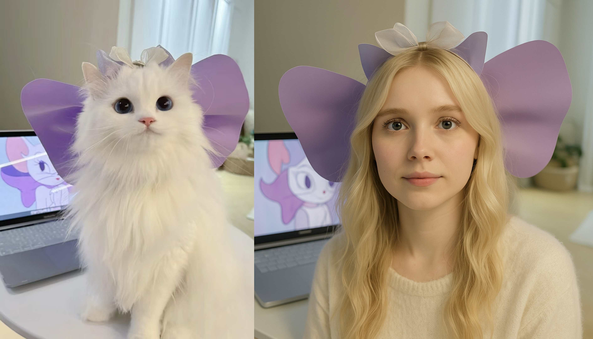
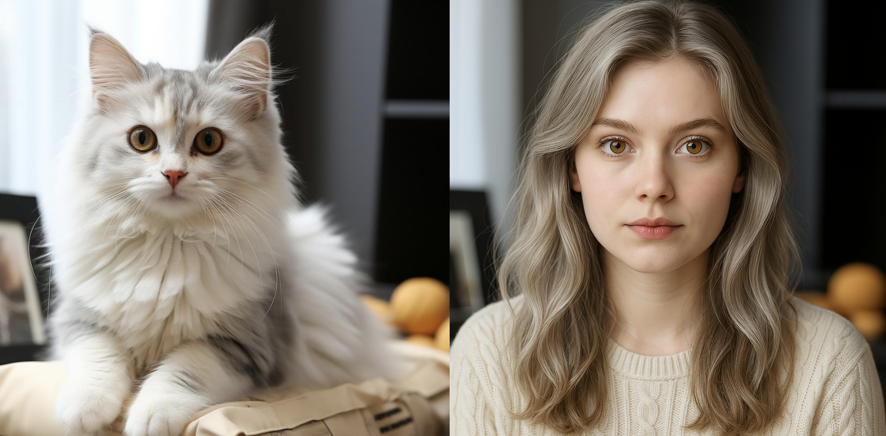
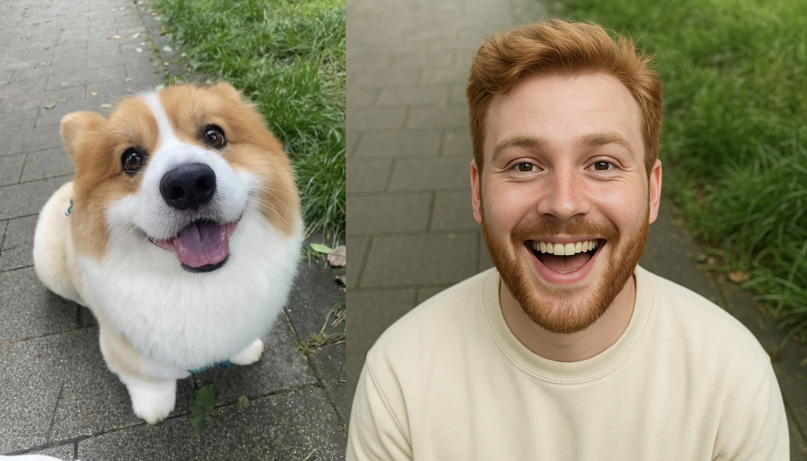

# Turn Your Pet into a Human with AI

Ever wondered what your furry friend would look like as a human? With [**Pet To Human**](https://pettohuman.com), you can turn that curiosity into reality! Our cutting-edge AI technology transforms your pet’s photo into a stunning human portrait, capturing their unique personality and charm in just seconds. Whether it’s your playful pup, cuddly cat, or even a quirky hamster, Pet To Human brings their essence to life in a fun and creative way.

Below is an example of a pet transformed into a human using our AI:

## Why Choose Pet To Human?

### 1. Instant Magic with AI

Upload a clear photo of your pet, and our AI works its magic in **1-2 minutes**, creating a high-resolution human portrait that reflects your pet’s expressions and vibe. No waiting, no hassle—just instant results you’ll love

### 2. Privacy You Can Trust

We take your privacy seriously. Pet To Human **does not store** your uploaded photos or generated images. Once you download your transformation, all data is automatically deleted from our servers, ensuring complete peace of mind.

### 3. Works for All Pets

While cats and dogs are our specialties, our AI can transform a variety of pets, including rabbits, birds, hamsters, and more. Just make sure to upload a photo that clearly shows your pet’s face for the best results.

### 4. High-Quality, Watermark-Free Downloads

Every transformation is delivered in **high resolution** with no watermarks, perfect for printing, sharing, or cherishing as a keepsake. You get a professional-quality portrait that’s ready to show off

### 5. Try It for Free

New users get **3 free transformation credit** upon signing up, so you can experience the magic of Pet To Human at no cost. Love the results? Choose from our flexible, one-time purchase plans—no subscriptions required

## Perfect for Every Pet Lover

Pet To Human is more than just a fun tool—it’s a way to celebrate the special bond you share with your pet. Imagine seeing your golden retriever’s friendly grin or your cat’s sassy smirk in human form! Pet owners across the globe are raving about how our AI captures their pet’s personality with astonishing detail.

> “I was amazed at how Pet To Human captured my golden retriever’s friendly personality! The portrait was so lifelike and fun to share with friends!” — Happy Pet Owner

## Easy to Use, Anywhere, Anytime

Pet To Human is **fully responsive**, meaning you can create transformations on your smartphone, tablet, or computer. Upload photos directly from your camera roll and download your humanized pet portrait on the go. It’s never been easier to bring a smile to your face

## Join the Trend

The pet-to-human transformation trend is taking social media by storm! From Instagram to TikTok, pet owners are sharing their AI-generated portraits and sparking joy online. Don’t miss out—join the fun and show the world what your pet would look like as a human

## Get Started Today

Ready to see your pet in a whole new light? Visit [**Pet To Human**](https://pettohuman.com), sign up for your free transformation credit, and let our AI work its magic. Choose from a range of plans tailored to your needs, from beginner-friendly options to premium packages for the ultimate pet transformation experience.

**Pet To Human**—where your pet’s personality meets human creativity. Transform, download, and share the love today!

